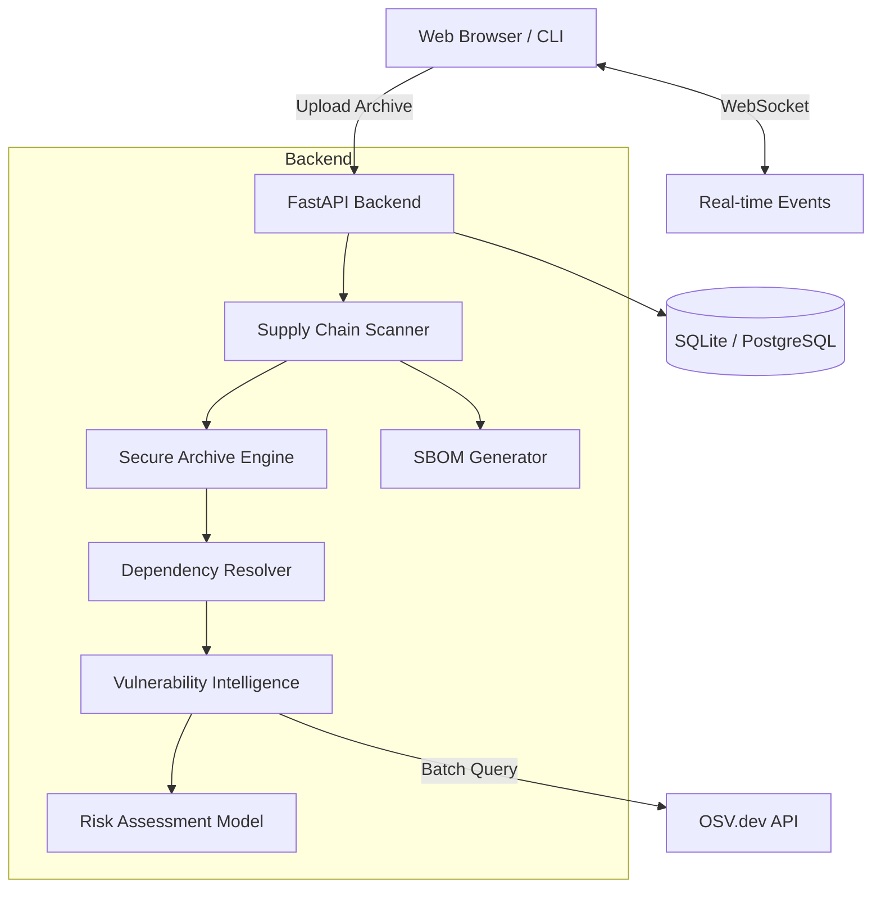
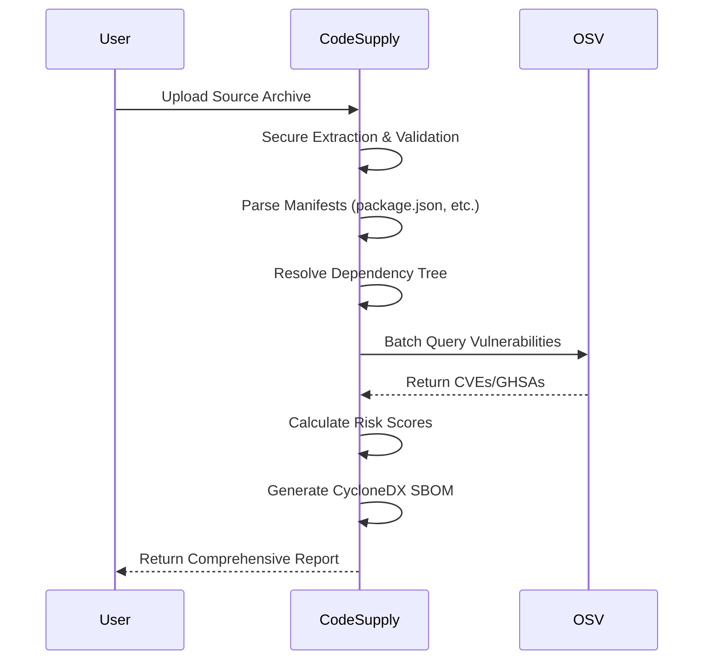

<div align="center">

# 🛡️ CodeSupply

**The Ultimate Software Supply-Chain Intelligence Platform**

[](https://opensource.org/licenses/MIT)
[](https://fastapi.tiangolo.com)
[](https://nextjs.org)

*Deep inspection, vulnerability scanning, and risk assessment for your entire software supply chain.*

</div>

---

## ✨ Features

- **📦 Comprehensive Ecosystem Support**: Analyzes npm, Python, Maven, Go, and Rust.
- **🔍 Deep Archive Inspection**: Securely extracts and analyzes code archives (ZIP, TAR).
- **📋 SBOM Generation**: Produces CycloneDX 1.7 compliant Software Bill of Materials.
- **🚨 Vulnerability Intelligence**: Real-time vulnerability matching powered by OSV.dev and CVSS v3.1.
- **📊 Advanced Risk Modeling**: Multi-factor risk assessment combining vulnerability severity, project health, and exposure.
- **⚡ Real-time Analysis**: WebSocket-powered live scan progress and instant SBOM diffing.
- **🔒 Security-First Architecture**: Built-in protections against zip slip, symlink attacks, and decompression bombs.

---

## 🏗️ Architecture



---

## 🌐 Ecosystem Support

| Ecosystem | Dependency Resolution | Vulnerability Scanning | Risk Assessment | SBOM Generation | Status |
| :--- | :---: | :---: | :---: | :---: | :---: |
| **npm** (Node.js) | ✅ | ✅ | ✅ | ✅ | Beta / Supported |
| **PyPI** (Python) | ✅ | ✅ | ✅ | ✅ | Beta / Supported |
| **Maven** (Java) | ✅ | ✅ | ✅ | ✅ | Beta / Supported |
| **Go** | ✅ | ✅ | ✅ | ✅ | Beta / Supported |
| **Cargo** (Rust) | ✅ | ✅ | ✅ | ✅ | Beta / Supported |

---

## 🔄 Data Flow Pipeline



---

## 📋 SBOM Standards

CodeSupply generates Software Bill of Materials (SBOM) strictly adhering to the **CycloneDX 1.7** specification. Our SBOMs are designed to meet regulatory compliance requirements, including alignment with **NIST** guidelines for securing the software supply chain. Every generated SBOM includes full dependency graphs, licensing information, and cryptographic hashes where available.

## 🚨 Vulnerability Intelligence

Our vulnerability engine integrates directly with **OSV.dev**, the open-source vulnerability database.
- **Batch Querying**: Analyzes thousands of dependencies in seconds without rate-limiting bottlenecks.
- **CVSS v3.1 Scoring**: Provides accurate severity metrics and vector strings for precise threat modeling.
- **Transitive Vulnerability Tracing**: Maps vulnerabilities deep within your dependency tree back to the root cause.

## 📊 Risk Model

Vulnerabilities alone don't equal risk. CodeSupply employs a **multi-factor risk assessment model**:
- **Exploitability**: How likely is the vulnerability to be exploited in the wild?
- **Impact**: What is the potential damage (Confidentiality, Integrity, Availability)?
- **Reachability**: Is the vulnerable code actually being used in your execution path?
- **Project Health**: Considers the maintainability and update frequency of the affected package.

## 🔒 Security Model

We run untrusted code, so security is paramount:
- **Archive Hardening**: Bulletproof extraction preventing Zip Slip and symlink traversal attacks.
- **Decompression Bomb Protection**: Strict limits on extraction ratios and file sizes.
- **Magic Bytes Validation**: Enforces strict file type validation beyond extensions.
- **No Code Execution**: Static analysis only; dependencies are parsed, never executed.
- **Network Security**: Aggressive rate limiting, SSRF protection, and hardened security headers.

## ⚡ Real-time Features

- **Live Scan Progress**: Track the exact stage of your scan (Extraction -> Parsing -> OSV Querying -> Scoring) via WebSockets.
- **SBOM Diffing**: Instantly compare two SBOMs to identify new vulnerabilities, added dependencies, or license changes across builds.

---

## 🚀 Quick Start

### Option 1: Docker (Recommended)

```bash
# Clone the repository
git clone https://github.com/your-org/CodeSupply.git
cd CodeSupply

# Start the stack
docker-compose up -d

# Visit the dashboard
open http://localhost:3000
```

### Option 2: Manual Setup

**Backend (Python)**
```bash
cd backend
python -m venv venv
source venv/bin/activate  # or `venv\Scripts\activate` on Windows
pip install -r requirements.txt
uvicorn app.main:app --reload --port 8000
```

**Frontend (Next.js)**
```bash
cd frontend
npm install
npm run dev
```

---

## 📚 API Reference (Highlights)

| Method | Endpoint | Description |
| :--- | :--- | :--- |
| `POST` | `/api/v1/scan/archive` | Upload and scan a project archive |
| `GET` | `/api/v1/scan/{id}` | Retrieve scan results and risk report |
| `GET` | `/api/v1/scan/{id}/sbom` | Download CycloneDX SBOM |
| `POST` | `/api/v1/sbom/diff` | Compare two generated SBOMs |
| `WS` | `/api/v1/ws/scan/{id}` | Real-time scan progress |

*For full API documentation, see [docs/API.md](docs/API.md).*

---

## 🧪 Testing

CodeSupply maintains a high standard of quality with comprehensive test suites.

**Backend**
```bash
cd backend
pytest --cov=app tests/
```

**Frontend**
```bash
cd frontend
npm run test
```

---

## 📂 Project Structure

```text
CodeSupply/
├── backend/                # FastAPI Application
│   ├── app/
│   │   ├── api/            # Route handlers
│   │   ├── core/           # Security, config, risk models
│   │   ├── services/       # Scanning, OSV, SBOM generation
│   │   └── models/         # Database schemas
│   └── tests/              # Backend test suite
├── frontend/               # Next.js Application
│   ├── components/         # React components (shadcn/ui)
│   ├── lib/                # API clients, hooks
│   └── app/                # Next.js App Router pages
├── docs/                   # Extended Documentation
└── docker-compose.yml
```

---

## 📄 License

This project is licensed under the **MIT License**. See the `LICENSE` file for details.

---

## 🏆 Credits

Built by the CodeSupply Team. Dedicated to securing the open-source ecosystem.
