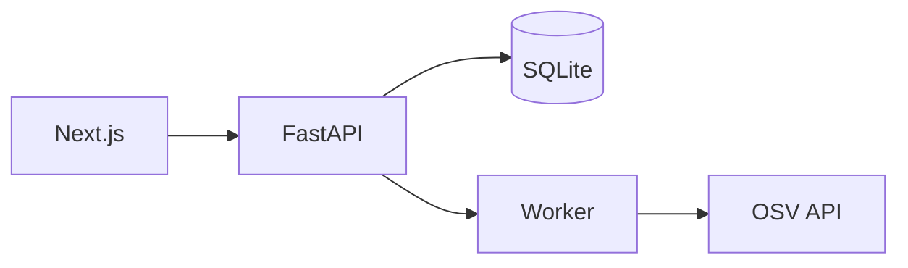
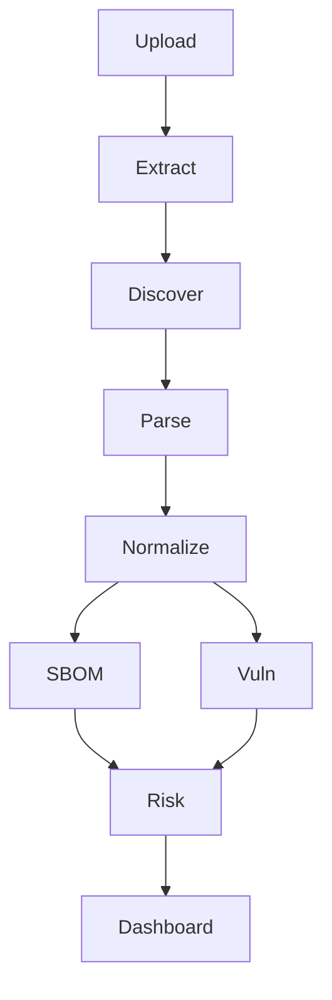

# CodeSupply
*Understand your software supply chain.*

## What is CodeSupply?
CodeSupply is a software supply-chain intelligence platform that analyzes project manifests and dependencies to identify vulnerabilities and risks. It takes an archive of your project and generates actionable insights.

It uses a non-intrusive approach, parsing lockfiles and manifests without ever executing code or running package managers.

## Features
- Multi-ecosystem support
- Deep dependency resolution
- Vulnerability scanning with OSV
- CycloneDX SBOM generation
- Risk scoring and assessment

## Architecture
Next.js → FastAPI → SQLite, Worker pipeline, OSV integration.



## Supported Ecosystems
| Ecosystem | Status | Manifests | Capabilities |
|-----------|--------|-----------|--------------|
| Node.js   | Beta   | package.json, package-lock.json | SBOM, Vuln, Risk |
| Python    | Beta   | requirements.txt, pyproject.toml | SBOM, Vuln, Risk |
| Java      | Alpha  | pom.xml | SBOM |
| Go        | Alpha  | go.mod | Detection |
| Rust      | Alpha  | Cargo.toml | Detection |

## Data Flow


## SBOM
Generates valid CycloneDX 1.5 JSON SBOMs containing resolved dependencies and PURLs.

## Vulnerability Intelligence
Integrates with OSV.dev for real-time vulnerability data. Uses batching and caching for resilience.

## Risk Model
Calculates risk scores based on vulnerability severity, missing versions, and intelligence availability.

## Security Model
See [Security Documentation](docs/security.md). ZIP security, no code execution, SSRF protection, logging policy.

## Limitations
- Only parses known lockfiles/manifests.
- Does not scan source code for vulnerabilities.

## Quick Start
### Prerequisites
- Python 3.11+
- Node.js 20+

### Setup
```bash
# Clone the repository
git clone ...

# Backend setup
cd backend
python -m venv .venv
source .venv/bin/activate
pip install -e ".[dev]"
uvicorn app.main:app --reload

# Start worker
python -m app.workers.runner

# Frontend setup
cd ../frontend
npm install
npm run dev
```
Open browser at `http://localhost:3000`.

## Environment Variables
| Variable | Default | Description |
|----------|---------|-------------|
| DATABASE_URL | sqlite+aiosqlite:///./codesupply.db | DB URL |
| MAX_UPLOAD_SIZE_MB | 100 | Max upload size |

## Docker
Run `docker-compose up --build` to start all services.

## Testing
- Backend: `cd backend && pytest -v`
- Frontend: `cd frontend && npm test`

## API Reference
- `POST /api/scan`: Upload archive and start scan
- `GET /api/scans/{id}`: Get scan status
- `GET /api/scans/{id}/sbom`: Get SBOM

## Sample Project
Use `sample-projects/demo-project/` to test capabilities. Or generate a zip using `scripts/create-sample-zip.py`.

## Demo Walkthrough
1. Upload demo-project zip.
2. Wait for analysis.
3. View high risk due to lodash vulnerability.
4. Export SBOM.

## Troubleshooting
- **OSV API Rate Limit**: CodeSupply uses caching. If rate limited, wait for cache to expire or use batching.

## Roadmap
- C/C++ support
- GitHub App integration
